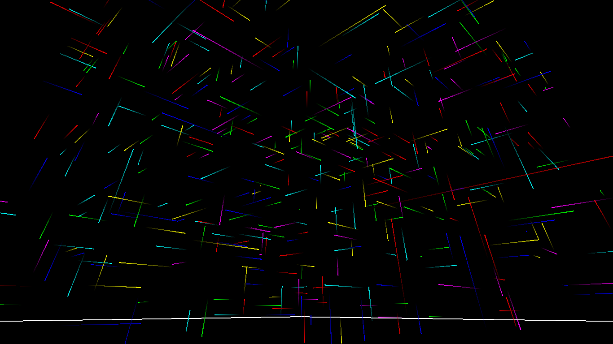

# Locus
Locus (n). Centre or focus of great activity or intense concentration. 3D version of [Nexus](https://github.com/adjl/Nexus), remade in [A-Frame](https://aframe.io).

Sit back and enjoy the light show.

## Issues
Found a bug, have a question, or suggestion for enhancement? Please [file an issue](https://github.com/adjl/Locus/issues).

## License
[MIT License](LICENSE)
